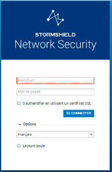

# Configuration du firewall lan (stormshield)

On a appuyé 15s sur le bouton reset qui est derrière de l'appareil jusqu'à les LEDs clignotte, une fois qui ça a fini de se réinitialisé on peut s'y connecté en se méttant sur le réseau 10.0.0.0/24 pour pouvoir se connecter à l'IP 10.0.0.254. 

Ensuite j'ai mit en place les interfaces réseau du LAN et WAN.

Pour l'interface du LAN, j'ai fait passer les vlans LAN et MANA. en créant les VLANs dans l'interface in que j'ai ensuite déjactiver l'interface IN pour que uniquement les VLANs passent.

ensuite j'ai créer des objet pour les routes et la gateway. ce qui m'a permit de faire la route de retour.

